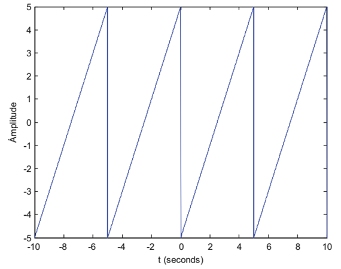

# Take Home Mid-Term Test Linear System

**Nama:** Juhen Fashikha Wildan  
**NIM:** 163221047

## Table of Contents
- [Problem 1: Sawtooth Signal](#problem-1-sawtooth-signal)
- [Problem 2: Sinusoidal and Exponential Damped Signals](#problem-2-sinusoidal-and-exponential-damped-signals)
  - [Part (a)](#solution-a)
  - [Part (b)](#solution-b)
- [Problem 3: Discrete Signals and Convolution](#problem-3-discrete-signals-and-convolution)
- [Problem 4: Second-Order ODE](#problem-4-second-order-ode)
- [Problem 5: DC Motor Model](#problem-5-dc-motor-model)
  - [Condition 1](#condition-1)
  - [Condition 2](#condition-2)
  - [Condition 3](#condition-3)
  - [Condition 4](#condition-4)

## Problem 1: Sawtooth Signal
<p align="center">
  
</p>

```matlab
% T = 1/f = (1/(1/5Hz) = 5 second; % periode
T = 4*(5); % Menghasilkan 4 periode gelombang sawtooth dengan frekuensi dasar 1/5 Hz.

fs = 1000; % sampling frequency
t = -10:1/fs:T-1/fs;

x = 5*sawtooth(2*pi*1/5*t); % sawtooth(2*pi*f*t), f = 1/5 Hz, T = 5 second

plot(t,x, "LineWidth", 1.5)
grid on
xlabel('t (seconds)')
ylabel('Amplitudo')
xlim([-10 10])
title('Grafik Problem 1')
```

## Problem 2: Sinusoidal and Exponential Damped Signals
### Solution (a)
```matlab
fs = 1000;
t = -10:1/fs:10;
x = 10*sin(2*pi*t).*cos(pi*t-4);

plot(t,x, "LineWidth",1.5)
grid on
ylabel('x(t)')
xlabel('t')
title('Grafik Problem 2(a)')
```

### Solution (b)
```matlab
fs = 1000;
t = -5:1/fs:5;
x = 2*exp(-0.1*t).*sin(2*pi*t);

plot(t,x, "LineWidth",1.5)
grid on
ylabel('x(t)')
xlabel('t')
title('Grafik Problem 2(b)')
```

## Problem 3: Discrete Signals and Convolution
**Cara 1:**
```matlab
% sinyal x[n]
n = 0:0.5:5;
x = [1,1,1,1,1,1,1,1,1,1,1];
stem(n,x,'filled')
xlabel('n values');
ylabel('x[n]');
ylim([0 1.2])
xlim([0 5.5])

% sinyal h[n]
n = 0:0.5:2;
h = [0,1,1,1,0];
stem(n,h,'filled')
xlabel('n values');
ylabel('h[n]');
ylim([0 1.2])
xlim([0 2.2])

% Konvolusi sinyal y[n]
n = 0:14;
y = conv(x,h);
stem(n,y,'filled');
xlabel('n values');
ylabel('y[n]');
title('Grafik Problem 3: Linear conv y[n]');
ylim([0 3.2])
```
**Cara 2:**
```matlab
T = 0.001;
t = 0:T:10;

% sinyal x(t)
x = (t>=0)-(t>=5);
plot(t,x,"LineWidth",1.5)
grid on
xlabel('t')
ylabel('x(t)')
ylim([-0.2 1.2])
xlim([0 6])
title('sinyal x(t)')

% sinyal h(t)
h = (t>=0.5)-(t>=1.5);
plot(t,h,"LineWidth",1.5)
grid on
xlabel('t')
ylabel('h(t)')
ylim([-0.2 1.2])
xlim([0 6])
title('sinyal h(t)')

% Konvolusi sinyal y(t)
y = T*conv(x,h);
plot(0:T:20,y,"LineWidth",1.5);
xlabel('t values');
ylabel('y(t)');
title('Grafik Problem 3: Linear conv y(t)');
ylim([-0.2 1.2])
xlim([0 10])
```
## Problem 4: Second-Order ODE
```matlab
syms y(t)
Dy = diff(y);
ode = diff(y,t,2) == 2*diff(y,t)-2*y+cos(t)
cond1 = y(0) == 1;
cond2 = Dy(0) == 0;
conds = [cond1 cond2];
ySol(t) = dsolve(ode,conds)

t = 0:0.01:6;
y = (4/5)*exp(t).*cos(t)-(2/5)*exp(t).*sin(t)+cos(t).*((1/5)*cos(2*t)+(1/10)*sin(2*t))-sin(t).*((1/10)*cos(2*t)-(1/5)*sin(2*t)+(1/2));
plot(t,y,'LineWidth',1.5)
grid on
title('Problem 4: Solusi ODE')
```
## Problem 5: DC Motor Model
### Condition 1
```matlab
% Parameter Motor DC yang digunakan
J = 0.0014;% kg.m*2
b = 0.015;% N.m.s/rad
Kt = 0.01;% N.m/A
Kv = 0.01; % V/(rad/s)
R = 2.6; % Ohm
L = 0.00018; % Henry

P = tf(Kt,[J*L (J*R+b*L) (b*R+Kt*Kv)])

t = 0:0.001:100;
s1 = (t>=0);
v = 5*s1;
plot(t,v,"LineWidth",1.5)
grid on
xlabel('(sec)')
ylabel('(Volt)')
ylim([-0.5 5.5])
xlim([0 15])
title('Sinyal input')

kec_putar = lsim(P,v,t);
plot(t,kec_putar,'LineWidth',1.5)
grid on
ylim([-0.1 1.5])
xlim([0 1])
xlabel('(sec)')
ylabel('(rad/sec)')
title('Grafik Problem 5: kecepatan motor dalam (w(t))')

% Konversi ke rpm
kec_putar = 9.5493*kec_putar;
plot(t,kec_putar,'LineWidth',1.5)
grid on
ylim([-0.5 13])
xlim([0 1])
xlabel('(sec)')
ylabel('(rpm)')
title('Grafik Problem 5: kecepatan motor dalam (w(t))')
```
### Condition 2
```matlab
% Parameter Motor DC yang digunakan
J = 0.0014;% kg.m*2
b = 0.015;% N.m.s/rad
Kt = 0.042;% N.m/A
Kv = 0.042; % V/(rad/s)
R = 2.6; % Ohm
L = 0.00018; % Henry

P = tf(Kt,[J*L (J*R+b*L) (b*R+Kt*Kv)])

t = 0:0.001:100;
s1 = (t>=0);
v = 5*s1;
plot(t,v,"LineWidth",1.5)
grid on
xlabel('(sec)')
ylabel('(Volt)')
ylim([-0.5 5.5])
xlim([0 15])
title('sinyal input')

kec_putar = lsim(P,v,t);
plot(t,kec_putar,'LineWidth',1.5)
grid on
ylim([-0.1 6])
xlim([0 1])
xlabel('(sec)')
ylabel('(rad/sec)')
title('grafik Problem 5: kecepatan motor dalam (w(t))')

% Konversi ke rpm
kec_putar = 9.5493*kec_putar;
plot(t,kec_putar,'LineWidth',1.5)
grid on
ylim([-0.5 55])
xlim([0 1])
xlabel('(sec)')
ylabel('(rpm)')
title('grafik Problem 5: kecepatan motor dalam (w(t))')
```
### Condition 3
```matlab
% Parameter Motor DC yang digunakan
J = 0.0014;% kg.m*2
b = 0.015;% N.m.s/rad
Kt = 0.06;% N.m/A
Kv = 0.06; % V/(rad/s)
R = 2.6; % Ohm
L = 0.00018; % Henry

P = tf(Kt,[J*L (J*R+b*L) (b*R+Kt*Kv)])

t = 0:0.001:100;
s1 = (t>=0);
v = 5*s1;
plot(t,v,"LineWidth",1.5)
grid on
xlabel('(sec)')
ylabel('(Volt)')
ylim([-0.5 5.5])
xlim([0 15])
title('sinyal input')

kec_putar = lsim(P,v,t);
plot(t,kec_putar,'LineWidth',1.5)
grid on
ylim([-0.1 8])
xlim([0 1])
xlabel('(sec)')
ylabel('(rad/sec)')
title('grafik Problem 5: kecepatan motor dalam (w(t))')

% Konversi ke rpm
kec_putar = 9.5493*kec_putar;
plot(t,kec_putar,'LineWidth',1.5)
grid on
ylim([-0.5 70])
xlim([0 1])
xlabel('(sec)')
ylabel('(rpm)')
title('grafik Problem 5: kecepatan motor dalam (w(t))')
```
### Condition 4
```matlab
% Parameter Motor DC yang digunakan
J = 0.0014;% kg.m*2
b = 0.015;% N.m.s/rad
Kt = 0.1;% N.m/A
Kv = 0.1; % V/(rad/s)
R = 2.6; % Ohm
L = 0.00018; % Henry

P = tf(Kt,[J*L (J*R+b*L) (b*R+Kt*Kv)])

t = 0:0.001:100;
s1 = (t>=0);
v = 5*s1;
plot(t,v,"LineWidth",1.5)
grid on
xlabel('(sec)')
ylabel('(Volt)')
ylim([-0.5 5.5])
xlim([0 15])
title('sinyal input')

kec_putar = lsim(P,v,t);
plot(t,kec_putar,'LineWidth',1.5)
grid on
ylim([-0.1 11])
xlim([0 1])
xlabel('(sec)')
ylabel('(rad/sec)')
title('grafik Problem 5: kecepatan motor dalam (w(t))')

% Konversi ke rpm
kec_putar = 9.5493*kec_putar;
plot(t,kec_putar,'LineWidth',1.5)
grid on
ylim([-0.5 100])
xlim([0 1])
xlabel('(sec)')
ylabel('(rpm)')
title('grafik Problem 5: kecepatan motor dalam (w(t))')
```
